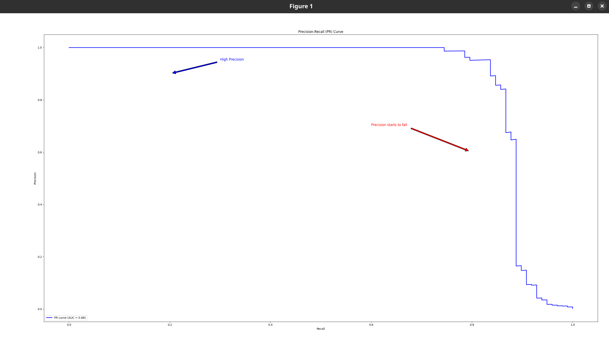
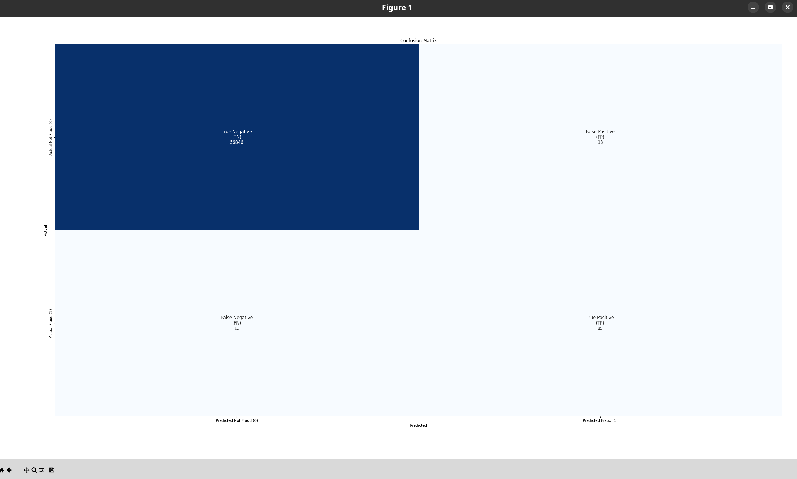

# Credit Card Fraud Detection

This project aims to detect fraudulent credit card transactions using machine learning techniques, specifically the XGBoost model. The dataset used in this project was downloaded from Kaggle.
Given the class imbalance ratio, script measuring the accuracy using the Area Under the Precision-Recall Curve (AUPRC).

## Dataset

The dataset used in this project contains transactions made by European cardholders over a period of two days in September 2013. It has been modified using Principal Component Analysis (PCA) for confidentiality reasons. 
This dataset presents transactions that occurred in two days, where we have 492 frauds out of 284,807 transactions. The dataset is highly unbalanced, the positive class (frauds) account for 0.172% of all transactions.
The dataset includes the following features:

- `Time`: Number of seconds elapsed between this transaction and the first transaction in the dataset.
- `V1, V2, ..., V28`: Principal components obtained from PCA.
- `Amount`: Transaction amount.
- `Class`: Label indicating whether the transaction is fraudulent (1) or not (0).

## Setup Virtual Environment

```bash
python3 -m venv venv
source venv/bin/activate
pip install -r requirements.txt
```

## Install

Fetch the data from Kaggle - [Credit Card Fraud Database](https://www.kaggle.com/datasets/mlg-ulb/creditcardfraud) dataset

```bash
kaggle datasets download -d mlg-ulb/creditcardfraud
```

To run the above command you would need [kaggle cli](https://github.com/Kaggle/kaggle-api) installed and API credentials setup. This can be done by following [this documentation](https://github.com/Kaggle/kaggle-api/blob/main/docs/README.md#kaggle-api).

You will get `creditcardfraud.zip` in the folder

Run:

```bash
unzip creditcardfraud.zip -d datasets/
```

This will extract the contents of `creditcardfraud.zip` into `datasets` directory

## Train Model

To train model run script execute:

```bash
python fraud-detection.py
```

Script will produce model `fraud_model.ubj`

## Test Model

Inference can be done using `prediction.py`. Make sure to move the `fraud_model.ubj` file to the datasets directory as well.

```bash
python prediction.py
```

Results will be `.png` images that represents confusion matrix and AUPRC



## Testing with Cocos

Make sure you have the Cocos repository cloned and set up. This can be done by following the instructions in the [Cocos Documentation](https://docs.cocos.ultraviolet.rs/getting-started/)

### Prerequisites

1. **Clone the repositories:**

   ```bash
   git clone https://github.com/ultravioletrs/cocos.git
   git clone https://github.com/ultravioletrs/ai.git
   ```

2. **Navigate to the fraud detection directory:**

   ```bash
   cd ai/fraud-detection
   ```

3. **Download and prepare the dataset:**

   Install kaggle-cli to download the dataset:

   ```bash
   pip install kaggle
   ```

   Set the [kaggle API key](https://github.com/Kaggle/kaggle-api/blob/main/docs/README.md#api-credentials) and download the dataset:

   ```bash
   kaggle datasets download -d mlg-ulb/creditcardfraud
   ```

   Prepare the dataset:

   ```bash
   unzip creditcardfraud.zip -d datasets/
   ```

4. **Change to cocos directory and build artifacts:**

   ```bash
   cd ../../cocos
   make all
   ```

5. **Generate keys:**

   ```bash
   ./build/cocos-cli keys -k="rsa"
   ```

### Finding Your Host IP Address

Find your host machine's IP address (avoid using localhost):

```bash
ip a
```

Look for your network interface (e.g., wlan0 for WiFi, eth0 for Ethernet) and note the inet address. For example, if you see `192.168.1.100`, use that as your `<YOUR_HOST_IP>`.

### Start Core Services

#### Start the Computation Management Server (CVMS)

From your cocos directory, start the CVMS server with the fraud detection algorithm and dataset:

```bash
cd cocos
HOST=<YOUR_HOST_IP> go run ./test/cvms/main.go -algo-path ../ai/fraud-detection/fraud-detection.py -public-key-path public.pem -attested-tls-bool false -data-paths ../ai/fraud-detection/datasets/creditcard.csv
```

Expected output:

```bash
{"time":"...","level":"INFO","msg":"cvms_test_server service gRPC server listening at <YOUR_HOST_IP>:7001 without TLS"}
```

#### Start the Manager

Navigate to the cocos/cmd/manager directory and start the Manager:

```bash
cd cocos/cmd/manager
sudo \
MANAGER_QEMU_SMP_MAXCPUS=4 \
MANAGER_QEMU_MEMORY_SIZE=8G \
MANAGER_GRPC_HOST=localhost \
MANAGER_GRPC_PORT=7002 \
MANAGER_LOG_LEVEL=debug \
MANAGER_QEMU_ENABLE_SEV_SNP=false \
MANAGER_QEMU_OVMF_CODE_FILE=/usr/share/edk2/x64/OVMF_CODE.fd \
MANAGER_QEMU_OVMF_VARS_FILE=/usr/share/edk2/x64/OVMF_VARS.fd \
go run main.go
```

Expected output:

```bash
{"time":"...","level":"INFO","msg":"Manager started without confidential computing support"}
{"time":"...","level":"INFO","msg":"manager service gRPC server listening at localhost:7002 without TLS"}
```

### Create CVM and Upload Fraud Detection Algorithm

#### Create CVM

From your cocos directory:

```bash
export MANAGER_GRPC_URL=localhost:7002
./build/cocos-cli create-vm --log-level debug --server-url "<YOUR_HOST_IP>:7001"
```

**Important:** Note the id and port from the cocos-cli output.

Expected output:

```bash
🔗 Connected to manager using  without TLS
🔗 Creating a new virtual machine
✅ Virtual machine created successfully with id <CVM_ID> and port <AGENT_PORT>
```

Expected CVMS server output:

```bash
&{message:"Method InitComputation for computation id 1 took ... to complete without errors"  computation_id:"1"  level:"INFO"  timestamp:{...}}
&{event_type:"ReceivingAlgorithm"  timestamp:{...}  computation_id:"1"  originator:"agent"  status:"InProgress"}
&{message:"agent service gRPC server listening at 10.0.2.15:<AGENT_PORT> without TLS"  computation_id:"1"  level:"INFO"  timestamp:{...}}
```

#### Export Agent gRPC URL

Set the AGENT_GRPC_URL using the port noted in the previous step (default 6100):

```bash
export AGENT_GRPC_URL=localhost:<AGENT_PORT>
```

#### Upload Fraud Detection Algorithm

From your cocos directory:

```bash
./build/cocos-cli algo ../ai/fraud-detection/fraud-detection.py ./private.pem -a python -r ../ai/fraud-detection/requirements.txt
```

Expected output:

```bash
🔗 Connected to agent  without TLS
Uploading algorithm file: ../ai/fraud-detection/fraud-detection.py
🚀 Uploading algorithm [███████████████████████████████████████████████████████████████████████████████████████████████████████████████████████████████████████████████████████████████████████████████████████████████████████████████████████████████] [100%]                               
Successfully uploaded algorithm! ✔ 
```

#### Upload Fraud Detection Dataset

Upload the fraud detection dataset:

```bash
./build/cocos-cli data ../ai/fraud-detection/datasets/creditcard.csv ./private.pem
```

Expected output:

```bash
🔗 Connected to agent  without TLS
Uploading dataset: ../ai/fraud-detection/datasets/creditcard.csv
📦 Uploading data [██████████████████████████████████████████████████████████████████████████████████████████████████████████████████████████████████████████████████████████████████████████████████████████████████████████████████████████████████] [100%]                               
Successfully uploaded dataset! ✔ 
```

Watch the CVMS server logs for training progress. Look for completion messages:

```bash
&{message:"Method Data took ... to complete without errors"  computation_id:"1"  level:"INFO"  timestamp:{...}}
&{event_type:"Running"  timestamp:{...}  computation_id:"1"  originator:"agent"  status:"Starting"}
&{event_type:"Running"  timestamp:{...}  computation_id:"1"  originator:"agent"  status:"Completed"}
&{event_type:"ConsumingResults"  timestamp:{...}  computation_id:"1"  originator:"agent"  status:"Ready"}
```

#### Download Fraud Detection Results

From your cocos directory:

```bash
./build/cocos-cli result ./private.pem
```

Expected output:

```bash
🔗 Connected to agent  without TLS
⏳ Retrieving computation result file
📥 Downloading result [██████████████████████████████████████████████████████████████████████████████████████████████████████████████████████████████████████████████████████████████████████████████████████████████████████████████████████████████] [100%]                               
Computation result retrieved and saved successfully as results.zip! ✔ 
```

#### Test the Trained Model

1. Copy results to the fraud detection directory:

   ```bash
   cp results.zip ../ai/fraud-detection/
   ```

2. Navigate to fraud detection directory and extract results:

   ```bash
   cd ../ai/fraud-detection
   unzip results.zip -d results
   ```

3. Test the model:

   ```bash
   python prediction.py
   ```

Expected output will show confusion matrix and AUPRC visualizations as .png images.

#### Remove Fraud Detection CVM

Use the `<CVM_ID>` obtained during CVM creation:

```bash
./build/cocos-cli remove-vm <CVM_ID>
```

Expected output:

```bash
🔗 Connected to manager using  without TLS
🔗 Removing virtual machine
✅ Virtual machine removed successfully
```

## Testing with Prism

Prism provides a web-based interface for managing Cocos computations.

### Prerequisites

1. **Clone and start Prism:**

   ```bash
   git clone https://github.com/ultravioletrs/prism.git
   cd prism
   make run
   ```

2. **Prepare fraud detection dataset** (follow the same steps as in the Cocos section above)

3. **Build Cocos artifacts:**

   ```bash
   cd cocos
   make all
   ```

4. **Generate keys:**

   ```bash
   ./build/cocos-cli keys -k="rsa"
   ```

### Prism Setup Process

1. **Create a user account**
2. **Create a workspace**
3. **Login to the created workspace**
4. **Create a CVM** and wait for it to come online
5. **Create the computation** and set a name and description.
6. Add participants using computation roles.

### Create Fraud Detection Computation

To create the computation in Prism, you'll need sha3-256 checksums for the dataset and algorithm. Generate these from the cocos folder:

```bash
./build/cocos-cli checksum ../ai/fraud-detection/datasets/creditcard.csv
./build/cocos-cli checksum ../ai/fraud-detection/fraud-detection.py
```

Use the file names `creditcard.csv` and `fraud-detection.py` when creating the computation asset in Prism. Link the assets to the computation.

### Upload Public Key

After creating the computation, upload your public key generated by `cocos-cli`. This enables you to upload datasets/algorithms and download results:

```bash
cat public.pem
```

### Run Computation

1. **Click "Run Computation"** and select an available cvm.
2. **Copy the agent port number** and export it:

   ```bash
   export AGENT_GRPC_URL=localhost:<AGENT_PORT>
   ```

3. **Upload the algorithm and dataset:**

   ```bash
   ./build/cocos-cli algo ../ai/fraud-detection/fraud-detection.py ./private.pem -a python -r ../ai/fraud-detection/requirements.txt
   ./build/cocos-cli data ../ai/fraud-detection/datasets/creditcard.csv ./private.pem
   ```

4. **Monitor the computation** through the Prism interface until you receive an event indicating results are ready

5. **Download the results:**

   ```bash
   ./build/cocos-cli result ./private.pem
   ```

### Test Results

Follow the same testing steps as in the Cocos section:

```bash
cp results.zip ../ai/fraud-detection/
cd ../ai/fraud-detection
unzip results.zip -d results
python prediction.py
```

## Notes

- The fraud detection model training is relatively fast compared to image-based models
- Memory allocation of 8GB should be sufficient for the Manager
- The model works with credit card transaction data and produces binary classification (fraud/non-fraud)
- Results include confusion matrix and AUPRC visualizations to evaluate model performance
