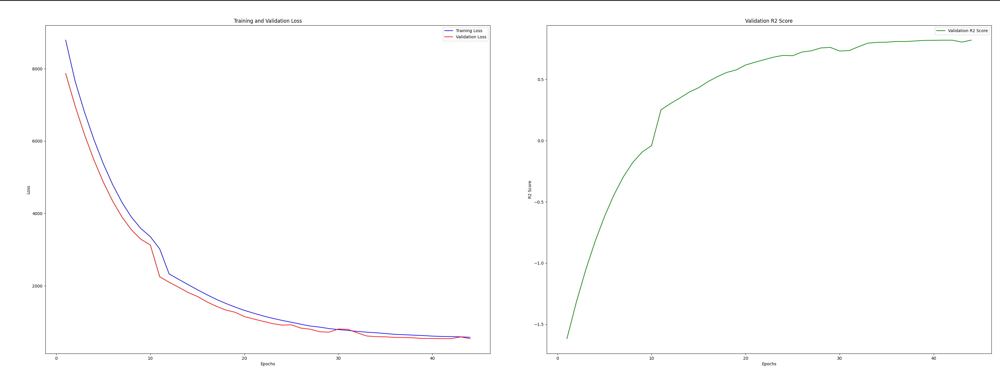
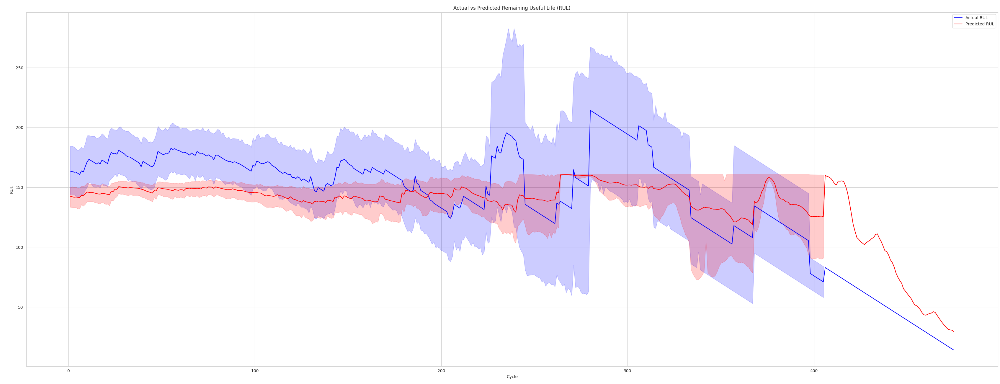

111# Remaining Useful Life (RUL) Prediction with LSTM

This repository contains code and resources for predicting the Remaining Useful Life (RUL) of machinery using Long Short-Term Memory (LSTM) neural networks. The dataset used for this project is provided by NASA and was downloaded from Kaggle.

## Table of Contents
- [Introduction](#introduction)
- [Dataset](#dataset)
- [Model Architecture](#model-architecture)
- [Results](#results)

## Introduction
Predicting the Remaining Useful Life (RUL) of machinery is crucial for maintenance planning and avoiding unexpected failures. This project leverages a Long Short-Term Memory (LSTM) neural network to predict RUL based on sensor data.

## Dataset
The dataset used in this project is from NASA's Prognostics Data Repository, available on Kaggle. It consists of sensor measurements from machinery over time, including data from various operational conditions.

### Experimental Scenario

This project serves as an experimental exploration into predictive maintenance using machine learning techniques. While the results are promising, it's important to note that this is an experimental setup. Download datasets:

- [NASA Dataset on Kaggle](https://www.kaggle.com/datasets/behrad3d/nasa-cmaps)  
or you can also download datasets here:
- [NASA website](https://www.nasa.gov/intelligent-systems-division/discovery-and-systems-health/pcoe/pcoe-data-set-repository/)

The NASA CMAPSS dataset includes the following key components:

- **Engine ID**: Identifies the specific engine. Typical sensors include Fan Speed, Pressure, Temperature, Flow rates.
- **Cycle**: The time cycle for the recorded measurements.
- **Setting 1, 2, 3**: These are the operational settings that influence the engine's performance.
- **Sensor 1 to Sensor 21**: These columns represent various sensor measurements monitoring different parameters of the engine.

Dataset is divided into four data sets:

Data Set: FD001
Train trjectories: 100
Test trajectories: 100
Conditions: ONE (Sea Level)
Fault Modes: ONE (HPC Degradation)

Data Set: FD002
Train trjectories: 260
Test trajectories: 259
Conditions: SIX 
Fault Modes: ONE (HPC Degradation)

Data Set: FD003
Train trjectories: 100
Test trajectories: 100
Conditions: ONE (Sea Level)
Fault Modes: TWO (HPC Degradation, Fan Degradation)

Data Set: FD004
Train trjectories: 248
Test trajectories: 249
Conditions: SIX 
Fault Modes: TWO (HPC Degradation, Fan Degradation)

 Each data set is further divided into training and test subsets. Each time series is from a different engine, the data can be considered to be from a fleet of engines of the same type. Each engine starts with different degrees of initial wear and manufacturing variation which is unknown to the user.


The goal of using this dataset is to leverage these measurements and settings to predict the Remaining Useful Life (RUL) of the engines accurately.

## Model Architecture
The model architecture is based on LSTM (Long Short Term Memory), which is well-suited for time series prediction tasks. 
To train and evaluate the model, run the following command:

`python RUL_training.py`

## Results

The performance of the model is evaluated using metrics such as Mean Squared Error (Train Loss), Validation Mean Squared Error (Val Loss) and R² Score (Coefficient of Determination)

After the training process is completed, the algorithm saves the trained model to a file. This allows you to reuse the model for predictions without needing to retrain it each time. The model is saved in a `pth` format. Additionally, it generates graphs of training loss and validation loss over epochs to help visualize the model's learning process. This helps in visualizing the learning process and diagnosing potential issues like overfitting.



To use model, run:

`python pred_model.py`

Visualize Predictions: After running the script, it will generate a plot showing the predicted RUL versus the actual RUL. 

This plot helps in understanding how well the model predicts the Remaining Useful Life.
Here's an example of how the plot might look:



In this plot:

- The x-axis represents the time cycles.
- The y-axis represents the Remaining Useful Life (RUL).

The blue curve represents the actual RUL, while the red curve represents the predicted RUL. This visualization helps assess how well the model predicts the RUL compared to the ground truth.

## Testing with Prism

Make sure you have the Cocos repository cloned and eos buildroot installed. This can be done by following the instructions in the [Cocos Documentation](https://docs.cocos.ultraviolet.rs/getting-started/)

Clone the ai repository which has the rul-turbofan algorithm:

```bash
git clone https://github.com/ultravioletrs/ai.git
```

```bash
cd ai/rul-turbofan
```
In your browser launch to PRISM SaaS at https://prism.ultraviolet.rs.

- Create a user at https://prism.ultraviolet.rs.
- Create a workspace
- Login to the created workspace
- Create a backend.
- Issue Certs for the backend, request download and download the certs
- Unzip the folder and copy the contents to the managers `cmd/manager/` directory under `cocos` folder
- Start the manager with the backend address.

The following recordings demonstrate how to set up prism and run computation: [Part1](https://jam.dev/c/a9d0771c-eea7-4b91-8e78-b856a8fab1a6) and [Part2](https://jam.dev/c/a6e66c22-fdd9-42c0-9231-f8e3f074d28e)

Build cocos artifacts:

```bash
make all
```

Before running the computation server, we need to issue certificates for the computation server and the client. This is done from the PRISM SaaS.
Public/Private key pairs are needed for the users that will provide the algorithm, dataset and consume the results.

This can be done by running the following commands:

```bash
./build/cocos-cli keys
```

You need to have done the following:


  ```bash
  cd cmd/manager
  ```

  Make sure you have the `bzImage` and `rootfs.cpio.gz` in the `cmd/manager/img` directory.

  ```bash
  sudo \
  MANAGER_QEMU_SMP_MAXCPUS=4 \
  MANAGER_QEMU_MEMORY_SIZE=25G \
  MANAGER_GRPC_URL=localhost:7011 \
  MANAGER_LOG_LEVEL=debug \
  MANAGER_QEMU_ENABLE_SEV_SNP=false \
  MANAGER_QEMU_OVMF_CODE_FILE=/usr/share/edk2/x64/OVMF_CODE.fd \
  MANAGER_QEMU_OVMF_VARS_FILE=/usr/share/edk2/x64/OVMF_VARS.fd \
  MANAGER_GRPC_CLIENT_CERT=cert.pem \
  MANAGER_GRPC_CLIENT_KEY=key.pem \
  MANAGER_GRPC_SERVER_CA_CERTS=ca.pem \
  go run main.go
  ```

- Create the rul-training computation. To get the filehash for all the files go to `cocos` folder and use the cocos-cli. For the file names use `RUL_FD001.txt`, `test_FD001.txt`, `train_FD001.txt` and `rul-training.py`

  ```bash
  go run ./cmd/cli/main.go checksum  ../ai/rul-turbofan/datasets/RUL_FD001.txt
  ```

  ```bash
  go run ./cmd/cli/main.go checksum  ../ai/rul-turbofan/datasets/train_FD001.txt
  ```

   ```bash
  go run ./cmd/cli/main.go checksum  ../ai/rul-turbofan/datasets/test_FD001.txt
  ```

   ```bash
  go run ./cmd/cli/main.go checksum  ../ai/rul-turbofan/rul-training.py
  ```

- After the computation has been created, each user needs to upload their public key generated by `cocos-cli`. This key will enable the respective user to upload the datatsets and algorithms and also download the results.

  ```bash
  ./build/cocos-cli keys
  ```

- Click run computation and wait for the vm to be provisioned. Copy the aggent port number and export `AGENT_GRPC_URL`

  ```bash
  export AGENT_GRPC_URL=localhost:<port_number>
  ```

- After vm has been provisioned upload the datasets and the algorithm

  ```bash
  ./build/cocos-cli algo -a python  ../ai/rul-turbofan/rul-training.py ./private.pem -r ../ai/rul-training/requirements.txt
  ```

  ```bash
  ./build/cocos-cli data ../ai/rul-turbofan/datasets/RUL_FD001.txt ./private.pem
  ```

  ```bash
  ./build/cocos-cli data ../ai/rul-turbofan/datasets/test_FD001.txt ./private.pem
  ```

  ```bash
  ./build/cocos-cli data ../ai/rul-turbofan/datasets/train_FD001.txt ./private.pem
  ```
- The computation will run, and you will get an event that the results are ready. You can download the results by running the following command:

  ```bash
  ./build/cocos-cli results ./private.pem
  ```

The above will generate a `results.zip` file. Copy this file to the ai directory:

```bash
cp results.bin ../ai/rul-turbofan/
```

Test the model with the test data:

```bash
cd ../ai/rul-turbofan
```

```bash
unzip results.zip -d results
```